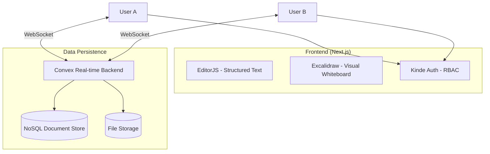

# 🖋️ Tabula

**Real-time collaborative workspace with whiteboard and rich-text editing.**

Tabula is a production-grade collaborative environment designed for teams to brainstorm and document ideas simultaneously. It bridges the gap between visual whiteboarding and structured documentation.

[](https://nextjs.org/)
[](https://www.typescriptlang.org/)
[](https://www.convex.dev/)

---

## 🏗 System Architecture



---

## 🚀 Engineering Highlights

### 1. Real-Time Synchronization at Scale
Leverages **Convex** for reactive data synchronization. Unlike traditional REST patterns, Tabula uses persistent WebSocket connections to push updates to all collaborators with sub-100ms latency, handling high-frequency drawing events from Excalidraw without state drift.

### 2. Complex Component Integration
Successfully integrated heavy client-side libraries (**Excalidraw** and **EditorJS**) within the Next.js App Router. Solved challenges related to:
- **SSR Compatibility:** Using dynamic imports and hydration guards to handle non-SSR-friendly canvas components.
- **State Management:** Bridging the gap between third-party internal state and Convex's global reactive state.

### 3. Secure Multi-Tenancy
Implemented **Role-Based Access Control (RBAC)** using **Kinde Auth**. Organizations are isolated at the database level, and middleware ensures that users only access workspaces belonging to their authorized team.

---

## 💻 Tech Stack

- **Framework:** Next.js 15 (App Router)
- **Language:** TypeScript (Strict Mode)
- **Real-time Engine:** Convex
- **Authentication:** Kinde (SSO & RBAC)
- **UI/UX:** Tailwind CSS, Radix UI (Shadcn/UI)
- **Visual Tools:** Excalidraw, EditorJS

---

## 🛠️ Setup Instructions

1. **Clone the repository**
   ```bash
   git clone https://github.com/belikedeep/tabula.git
   cd tabula
   ```

2. **Install dependencies**
   ```bash
   npm install
   ```

3. **Configure Environment**
   Create a `.env.local` file:
   ```env
   NEXT_PUBLIC_KINDE_CLIENT_ID=...
   CONVEX_DEPLOYMENT_URL=...
   ```

4. **Run Development Server**
   ```bash
   npm run dev
   ```

---

## 🎯 Production Considerations

- **Optimistic Updates:** Uses Convex's optimistic UI patterns to provide instant feedback even on slower connections.
- **Error Boundaries:** Implemented at the editor level to prevent a single plugin failure from crashing the entire workspace.
- **Data Integrity:** Schema validation enforced on the backend via Convex schema definitions.

---

## ⚖️ License

MIT - See [LICENSE](LICENSE) for details.
